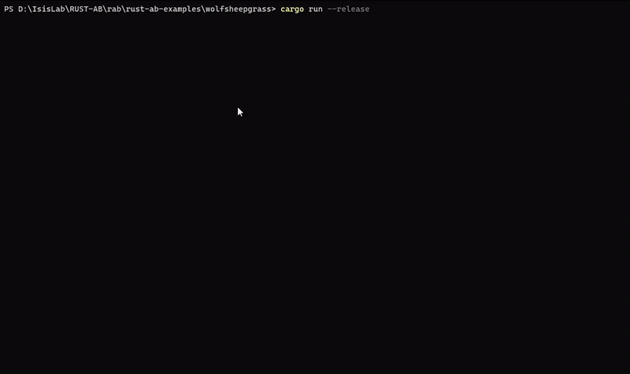

+++
title = "Introduction"
insert_anchor_links = "right"
+++

---

[Rust-AB](https://github.com/rust-ab/rust-ab) is a discrete events simulation engine for developing ABM simulation
written in the [Rust language](https://www.rust-lang.org/).

[Rust-AB](https://github.com/rust-ab/rust-ab) is designed to be a ready-to-use tool for the ABM community and for this
reason the architectural concepts of the well-adopted [MASON library](https://cs.gmu.edu/~eclab/projects/mason/) were
re-engineered to exploit the Rust peculiarities and programming model, in particular by keeping the visualization and the
simulation subsystems fully separated.

⚡ The actual community effort on [Rust-AB](https://github.com/rust-ab/rust-ab) is mainly devoted to supporting parallel
execution and model visualization using the [Bevy game engine](https://bevyengine.org/).

---
# Table of contents
<!-- no toc -->
- [Table of contents](#table-of-contents)
- [Dependencies](#dependencies)
- [How to run your first example simulaton](#how-to-run-your-first-example-simulaton)
- [How to write your first model](#how-to-write-your-first-model)
- [Macros for playing with Simulation Terminal](#macros-for-playing-with-simulation-terminal)
- [How to contribute](#how-to-contribute)
- [Architecture](#architecture)
  - [Agents](#agents)
  - [Simulation state](#simulation-state)
  - [Schedule](#schedule)
  - [Data structures](#data-structures)

---
<!-- # Usage

Add this to your `Cargo.toml`:

```toml
[dependencies]
rust-ab = { git="https://github.com/rust-ab/rust-ab.git" }
```

To simply run your simulation:
```sh
cargo run --release
```
 **Parallel execution**
can be achieved by passing the `parallel` feature when running a simulation and specifying the number of threads to use:

```sh 
cargo run --release --features parallel -- --nt <thread_num>
``` 
**Model Visualization with [Bevy Game Engine](https://bevyengine.org/)** to support model visualization.
To run your simulation with visualization you can use two command:
```sh
cargo make run --release
```
or 
```sh
cargo make serve --release
```
The first one to a traditional execution, the second one to execute simulation inside browser using **WASM**.
-->

# Dependencies
The visualization framework requires certain dependencies to run the simulation properly.
- 💻 Windows: [VS2019 build tools](https://visualstudio.microsoft.com/thank-you-downloading-visual-studio/?sku=BuildTools&rel=16)
- 🍎 MacOS: No dependencies needed.
- 🐧 Linux: A few dependencies are needed. Check [here](https://github.com/bevyengine/bevy/blob/main/docs/linux_dependencies.md) for a list based on your distribution.
---
# How to run your first example simulaton
First of all, install latest version of [Rust](https://www.rust-lang.org/tools/install). Follow steps to setup Rust toolchain (*cargo*, *rustc* and *rustup*).

Now, you can download/clone all available Rust-AB examples from our github repository called [rust-ab-examples](https://github.com/rust-ab/rust-ab-examples).

To run a simulation, go to root directory of a model, for example `/path/to/rust-ab-examples/flockers`. With command `ls`, you should be able to see a typcal Rust-AB simulation struct:
- src: main folder with code. It contains `main.rs` file and two directories for model and visulization components.
- Cargo.toml: Configuration file for Rust project, with dependencies and features.
- assets: an images folder. It contains all the icons that can be used for visualization.
- Makefile.toml: another configuration file, necessary to a correct execution of visualization.

Inside the root directory of model that you choose, you can run a models with or without visualization. 

To simply run your simulation, with no visualization:
```sh
cargo run --release
```
Running in this way, you can see our `Simulation Terminal` (better known as `Simulation Monitor`)) based on [tui-rs](https://github.com/fdehau/tui-rs), a rust library that provides components to create terminal with an interface. As a modelist, you can use Rust-AB macros to create several plots, print logs and add a model description (shown using a popup)




Based on [Bevy game engine](https://bevyengine.org/), it's possible to run simulation with visualization. It's also available a menu to start and stop simulations and a slider to set simulation speed.
To run a model with visualization enabled, you have to start the simulation with the command:
```sh
cargo run --release --features  visualization

# Alternative command. Requires 'cargo make' installed
cargo make run --release 
```

In addition to the classical visualization, you can run your Rust-AB simulation inside your browser using (*Web Assembly*)[https://webassembly.org]. 
This is possible with the command:
```sh
# Requires 'cargo make' installed
cargo make serve --release 
```


---
# How to write your first model
If you don't start from our [Template](https://github.com/rust-ab/rust-ab-examples/tree/main/template), add this to your `Cargo.toml`:
```toml
[dependencies]
rust-ab = { git="https://github.com/rust-ab/rust-ab.git" }

[features]
visualization = ["rust-ab/visualization"]
visualization_wasm = ["rust-ab/visualization_wasm"]
```

We **strongly** recommend to use [Template](https://github.com/rust-ab/rust-ab-examples/tree/main/template) or any other example as base of a new project, especially if you want to provide any visualization.

Each Rust-AB model needs structs that implements our *Traits*, one for *State* and the other for *Agent*. In the *State* struct you have to put *Agent* field(s), because it represents the ecosystem of a simulation. More details for each Rust-AB componenet are in the [Architecture](#architecture) section.

The simplest part is `main.rs`, because is similar for each example.
You can define two *main* functions using **cfg** directive, that can remove code based on which features are (not) enabled.  
Without visualization, you have only to use *simulate!* to run simulation, passing a state, step number and how may time repeat your simulation. 
With visualization, you have to set graphical settings (like dimension or background) and call *start* method.
```rs
// Main used when only the simulation should run, without any visualization.
#[cfg(not(any(feature = "visualization", feature = "visualization_wasm")))]
fn main() {
  let dim = (200., 200.);
  let state = Flocker::new(dim, num_agents);
  let step = 10;
  let reps = 1;
  let num_agents = 100;  
  let _ = simulate!(state, step, reps);
}

// Main used when a visualization feature is applied.
#[cfg(any(feature = "visualization", feature = "visualization_wasm"))]
fn main() {
  let dim = (200., 200.);
  let num_agents = 100;
  let state = Flocker::new(dim, num_agents);
  Visualization::default()
      .with_window_dimensions(1000., 700.)
      .with_simulation_dimensions(dim.0 as f32, dim.1 as f32)
      .with_background_color(Color::rgb(0., 0., 0.))
      .with_name("Flockers")
      .start::<VisState, Flocker>(VisState, state);
}

```
---
# Macros for playing with Simulation Terminal
`Simulation Terminal` is enabled by default using macro `simulate!`, so can be used passing a state, step number and how may time repeat your simulation..
That macro has a fourth optional parameter, a boolean. When `false` is passed, `Simulation Terminal` is disabled.
```rs
($s:expr, $step:expr, $reps:expr $(, $flag:expr)?) => {{
      // Macro code 
}}
```

You can create tabs and plot your data using two macro:
- `addplot!` let you create a new plot that will be displayed in its own tab.
```rs
addplot!(String::from("Chart Name"), String::from("xxxx"), String::from("yyyyy"));
```
- `plot!` to add a point to a plot. Points can be added during simulation execution, for example inside `after_step` method.
  You have to pass plot name, series name, x value and y value. Coordinate values need to be `f64`.
```rs
plot!(String::from("Chart name"), String::from("s1"), x, y);
```

On Terminal home page there is also a *log section*, you can plot log messages when some event needs to be noticed.
You can navigate among all logs using ↑↓ arrows.
To add a log use the macro `log!`, passing a `LogType` (an enum) and the log message.
```rs
 log!(LogType::Info, String::from("Log Message"));
```

Are available four type of Logs:
```rs
pub enum LogType {
    Info,
    Warning,
    Error,
    Critical,
}
```

---
# How to contribute
If you want to test, add or change something inside Rust-AB engine, you can clone [main repo](https://github.com/rust-ab/rust-ab) locally, and change dependecy inside `Cargo.toml` of your examples:

```toml
[dependencies]
# rust-ab = { git="https://github.com/rust-ab/rust-ab.git" }
rust-ab = { path="path/to/rust-ab"}
```

---

# Architecture
#### Agents

The Rust-AB framework defines a trait `Agent` that can be implemented on a struct to define `Agent` specific functionalities,
mainly the `step` method which specifies how the agent behaves for each simulation step, and the `get_id` method,
to uniquely identify an agent. There are also other methods, with default implementation, to improve agent control:

- `is_stopped` notify the scheduler if a specific agent should be removed or not, based on some condition.
- `before_step` and `after_step` to implement some operations before/after a step.

The Rust-AB framework allow multi-agent implementations: you can define multiple 'Agent' that
implement the trait, and [Wolf, Sheep & Grass](https://rust-ab.github.io/wolfsheepgrass/) is the main example of this feature.

#### Simulation state

The simulation state can be considered as the single source of truth of the simulation, where data resides and is updated.
Like `Agent`, Rust-AB exposes a `State` trait to let the user mark a particular structure as a simulation state, along with
exposing an `update` method to define logic to execute once for each simulation step. The simulation state is the perfect
structure to put field definitions on (such as 2D continuous fields, grids and so on). An important effect of the state being
the single source of truth forces agents to update (and most importantly read) their own location by interacting with the
state, even though they can store their own location locally in the agent structure too. Although, to be sure one is interacting
with the latest computed data, it is considered a good practice to update both an agent own location field and its copy on the
state structure.

#### Schedule

The simulation timeline is controlled by a Schedule structure that takes care of notifying all the scheduled agents, and the
simulation state that a step has been taken. For this reason, agents should be scheduled so that they can be notified when
a step has been taken.
The scheduler works as a priority queue, where the agents are sorted according to their scheduled time
and a priority value - an integer. The simulation time - a real value - starts from the scheduling time of the first agent.

The schedule structure exposed by the Rust-AB framework provides two methods to do so:

- `schedule_once` to insert an agent in the schedule for a specific simulation step. The scheduling time and the
  priority are given as parameters. The priority is used to sort all agents within the same simulation time.
  
- `schedule_repeating` which acts like schedule once, with the difference that the agent will be scheduled for all
  subsequent simulation steps.

The schedule provides the `step` method which allows executing one simulation step. In this way, the programmer can
easily design his/her simulation by looping for a certain number of step or for a given amount of CPU time.

#### Data structures

<!-- The Rust-AB framework exposes a few data structures based on the `DBDashMap`, a customized version of the 
[Rust HashMap](https://doc.rust-lang.org/std/collections/struct.HashMap.html) that implements a double
buffering technique to avoid indeterminism caused by the lack of knowledge of the agents' step execution order within a step.
The `DBDashMap` implements the interior mutability pattern, which allows the user to safely write in it without having an actual
mutable reference to the structure, because the reads are done on a different memory block than the writes. Only the `update`
method actually requires a mutable reference, to swap the read and the write buffers and commit the changes. -->

The currently implemented structures are:

- `Field2D`, a sparse matrix structure modelling agent interactions on a
  2D real space with coordinates represented by 2D f64 tuples (`Real2D`).
  
- `Grid2D`, a discrete field representing agents locations as 2D i64 tuples (`Int2D`). This structure keeps two copies of a DBDashMap in sync,
  one the inverse of the other, to allow constant time access both by key (agent) and by value (position). There are two kind of Grid based on density, `SparseGrid2D` and `DenseGrid2D`.
  
- `NumberGrid2D`, a simpler version of the `Grid2D` to use with simpler values. This is useful to represent simulation spaces
  covered by a simple entity that can be represented with a non-agent structure. This data structure can be used with any
  structure that can be cloned, most notably simple primitive values such as f64s. As the previous grid, there are two implementations: `SparseNumberGrid2D` and `DenseNumberGrid2D`.
  


